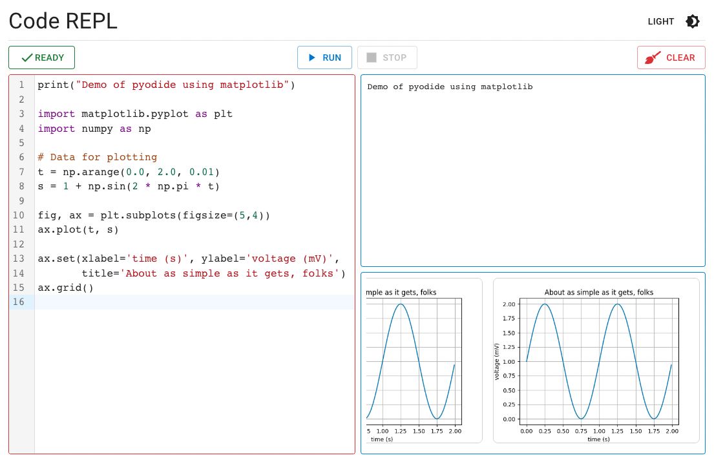
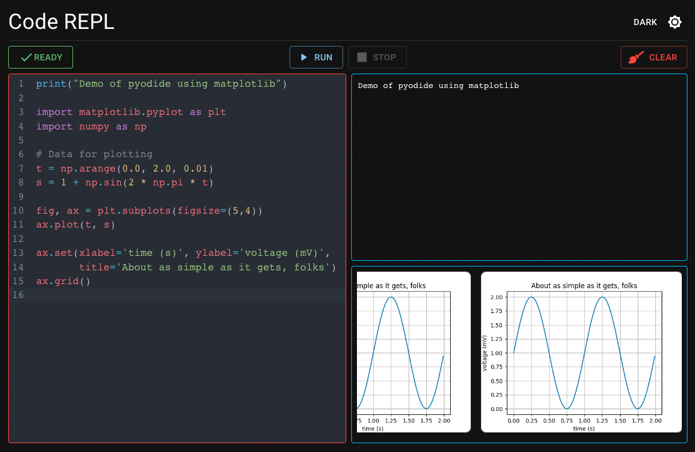

<div align="center">

</div>

# Pyodide REPL Demo App

<p align="center">


</p>

This is an app to demo the use of the 📦 [`@graasp/pyodide`](https://github.com/spaenleh/graasp-pyodide) package providing a library to execute python in the browser using WebAssembly.

Learn more about 🐍 Pyodide on [the official website](https://pyodide.org/en/stable/).

🔮 [Demo](https://sunny-croquembouche-04d733.netlify.app/) of the app

## Usage

To run the app locally:

```bash
# install the packages
yarn install
# start the local server
yarn start
```

## Contributing

Contributions are welcome, please submit improvements by submitting a pull request.

## License

[GNU AGPLv3](https://choosealicense.com/licenses/agpl-3.0/)
